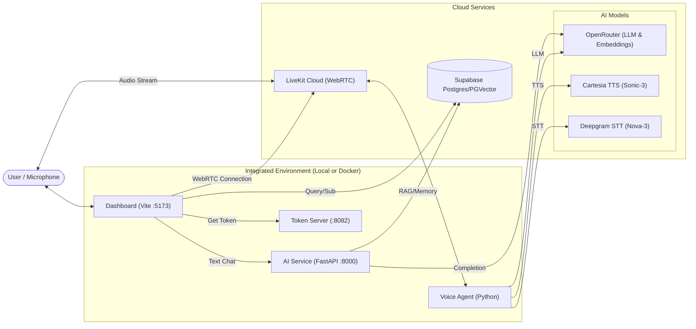

# AURA System Architecture

> **Purpose**: Technical documentation for LLMs and developers to understand AURA's hybrid architecture, data flow, and component interactions.

## 1. High-Level Overview

AURA is a **local-first, cloud-backed** virtual assistant that supports both native OS execution and containerized deployment via Docker.

-   **Frontend**: React (Vite) Dashboard for Chat, Admin, and System Monitoring.
-   **Backend**: 
    -   **AI Service**: FastAPI server for LLM orchestration (LangGraph) and Memory RAG (Supabase).
    -   **Voice Agent**: LiveKit Worker (Python) for real-time voice interaction.
    -   **Token Server**: Simple endpoint to issue LiveKit access tokens.
-   **Database**: Supabase (Postgres) for relational data, vectors (pgvector), and realtime subscriptions.
-   **Infrastructure**: 
    -   **Option A (Zero-Docker)**: 4 concurrent terminal processes managed by `start_aura.bat`.
    -   **Option B (Dockerized)**: Unified orchestration via `docker-compose.yml`.

## 2. Architecture Diagram

## 3. Component Details

### 3.1 AI Service (`/ai-service`)
-   **Framework**: FastAPI
-   **Core Logic**: `LangGraph` for stateful conversation flow (`perceive` -> `recall` -> `generate`).
-   **Memory**: Uses `supabase-vec` (pgvector) to store/retrieve memory chunks. No longer requires local Qdrant.
-   **API**:
    -   `POST /api/v1/chat`: Main chat endpoint (Text-to-Text).
    -   `POST /api/v1/memory`: Ingest documents.

### 3.2 Voice Agent (`/voice-agent`)
-   **Framework**: `livekit-agents` v1.3+
-   **Role**: Connects to a LiveKit Room as a specialized participant (Agent).
-   **Pipeline**:
    1.  **VAD**: Silero VAD detects speech.
    2.  **STT**: Deepgram (`nova-3`, multi-lingual) converts speech to text.
    3.  **LLM**: OpenRouter (`deepseek-chat` or configured model) generates text.
    4.  **TTS**: Cartesia (`sonic-3`) generates audio with high emotion and low latency.
-   **Key Feature**: Polyglot support (English, Indonesian, Japanese) and interruptibility.

### 3.3 Dashboard (`/dashboard`)
-   **Framework**: React 18 + Vite + TailwindCSS.
-   **Voice UI**: Uses `livekit-client` SDK to join the voice room.

### 3.4 Data Schema (Supabase)
-   **`conversations`**: Metadata (id, title, user_id).
-   **`messages`**: Chat history (content, role, emotion, CreatedAt).
-   **`memories`**: Knowledge base (content, embedding, metadata).
-   **`personality_settings`**: System prompts, voice settings, emotional baselines.

## 4. Environment Variables (`.env`)

A single `.env` file in the project root is shared by all services.

| Variable | Purpose |
|----------|---------|
| `CARTESIA_API_KEY` | Used for Cartesia TTS. |
| `OPENROUTER_API_KEY` | Used for LLM Inference & Embeddings. |
| `LIVEKIT_API_KEY` / `_SECRET` | Connection to LiveKit Cloud. |
| `LIVEKIT_URL` | LiveKit Room Server URL. |
| `DEEPGRAM_API_KEY` | Speech-to-Text. |
| `SUPABASE_URL` / `_KEY` | Database & Vector connection. |

## 5. Execution Modes

### 5.1 Native (Zero-Docker)
1.  Run `.\start_aura.bat`.
2.  Script manages local virtual environments and launches processes.

### 5.2 Containerized (Docker)
1.  Run `docker compose up --build`.
2.  Orchestrates AI Service, Voice Agent, Token Server, and Dashboard.

## 6. Design Philosophy
AURA prioritizes simplicity and performance. By offloading resource-heavy tasks (Database, STT, TTS) to optimized cloud providers, the core system remains lightweight enough to run on modest local hardware while providing a premium, low-latency experience.

